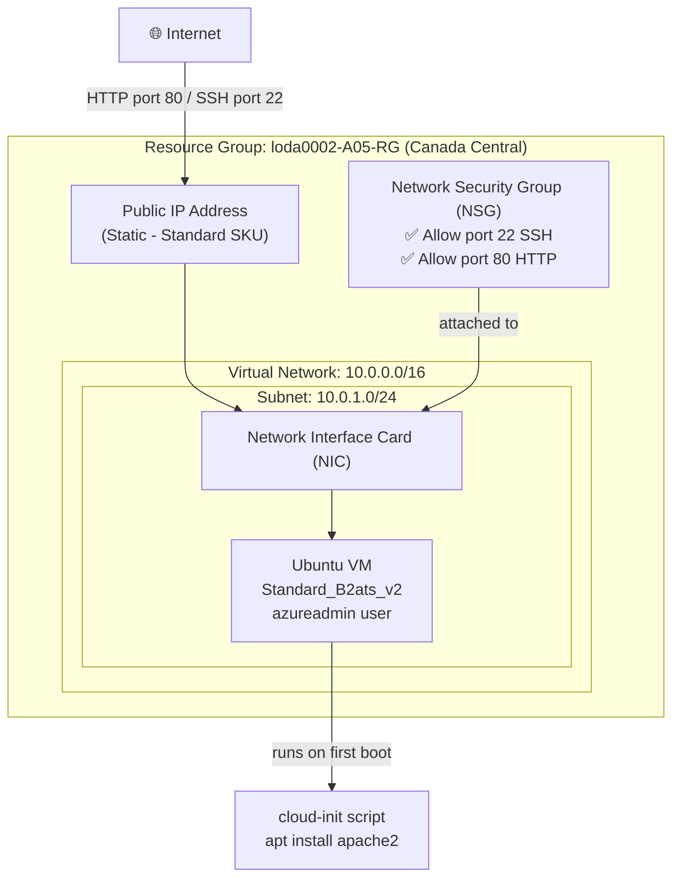

# LAB-A05 Terraform Web Server on Azure

**Course:** CST8918 - DevOps: Infrastructure as Code  
**Student:** Divyang (loda0002)  
**Professor:** Robert McKenney

---

## What is this lab about?

In this lab I used **Terraform** to deploy a simple web server on Microsoft Azure. Instead of clicking around in the Azure portal, I wrote code that automatically creates all the cloud resources I need. This is called **Infrastructure as Code (IaC)**.

The web server runs **Apache** on an **Ubuntu 22.04** virtual machine and is accessible from the internet using HTTP and SSH.

---

## Architecture Diagram



---

## Azure Resources Created

| Resource | Name | Purpose |
|---|---|---|
| Resource Group | loda0002-A05-RG | Logical container for everything |
| Public IP | loda0002-A05-PublicIP | Internet-facing IP address |
| Virtual Network | loda0002-A05-VNet | Private network (10.0.0.0/16) |
| Subnet | loda0002-A05-Subnet | Segment of VNet (10.0.1.0/24) |
| Network Security Group | loda0002-A05-NSG | Firewall rules (SSH + HTTP) |
| Network Interface | loda0002-A05-NIC | Connects VM to the network |
| Virtual Machine | loda0002-A05-VM | Ubuntu web server |

---

## Files in this project

```
cst8918-w26-A05-loda0002/
├── main.tf          # All Terraform resource definitions
├── init.sh          # Startup script that installs Apache
├── .gitignore       # Keeps secrets and temp files out of git
├── a05-architecture.png   # Architecture diagram image
└── a05-demo.png           # Screenshot of working deployment
```

---

## How to deploy

### Prerequisites
- Terraform CLI installed
- Azure CLI installed
- An SSH key pair at `~/.ssh/id_rsa.pub`
- Logged into Azure (`az login`)

### Steps

**1. Initialize Terraform** (downloads providers)
```bash
terraform init
```

**2. Deploy everything**
```bash
terraform apply
# When asked for labelPrefix, type: loda0002
# When asked to confirm, type: yes
```

**3. Verify it works**

After deploy finishes you'll see the public IP:
```
Outputs:
public_ip_address   = "20.x.x.x"
resource_group_name = "loda0002-A05-RG"
```

- Open `http://<public_ip>` in a browser → you should see the Apache default page
- SSH into the VM: `ssh azureadmin@<public_ip>`

---

## How to clean up

When you're done, delete all Azure resources to stop being charged:
```bash
terraform destroy
# Type: loda0002 when prompted
# Type: yes to confirm
```

---

## What I learned

- Terraform uses **providers** (like plugins) to talk to Azure
- You define **resources** in `.tf` files and Terraform figures out the right order to create them
- **Variables** make the code reusable - I can change the prefix and deploy a whole new environment
- **cloud-init** lets you run scripts on a VM right after it boots (that's how Apache got installed automatically)
- The **NSG (Network Security Group)** is basically a firewall - without opening ports 22 and 80, nothing would work even with a public IP

---

## Demo Screenshots

### VM Created


### Working Deployment (SSH)

